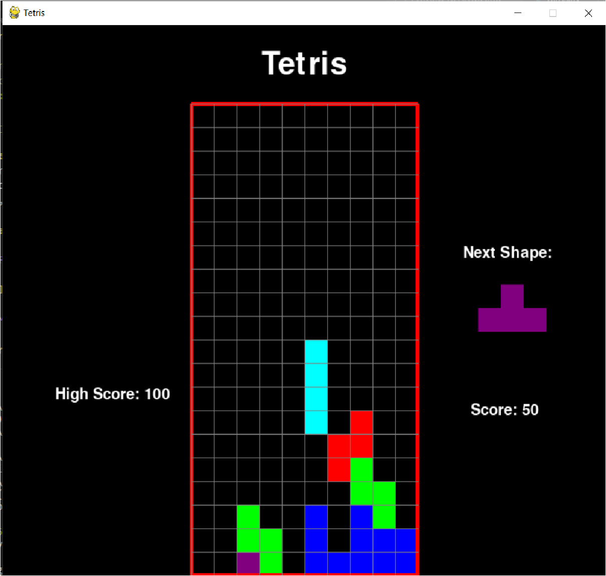

# Tetris_in_Python

- Repository: `Learning Python`
- Type of challenge:  `Learning new Possibilities`
- Duration: `1 day`
- [project objectives link](https://github.com/becodeorg/BXL-Swartz-3-21/tree/master/09-OOP-npProject)

## My Project
This project is a Tetris game with the help of pygame.  
This is one of my first projects and first ever game in python and is strongly inspired from a youtube video because those are my first steps with pygame and even python.  
It is very interesting to look on what python and pygame has to offer.  
inspired from: https://www.youtube.com/watch?v=uoR4ilCWwKA&t=6s&ab_channel=TechWithTim

## Instructions to test the game
- You need to be able to use python
- Copy paste tetris.py into your python file
- create a 'scores.txt' file and write 0 in it and save it (this saves the highscores)
- You then need to install the pygame module in your terminal with:  
```pip install pygame```
- The path to python must work!
- Then just run the file in the terminal an voilà! You can play Tetris!

## The Game 



## My Code


### Work in Progress ... 


